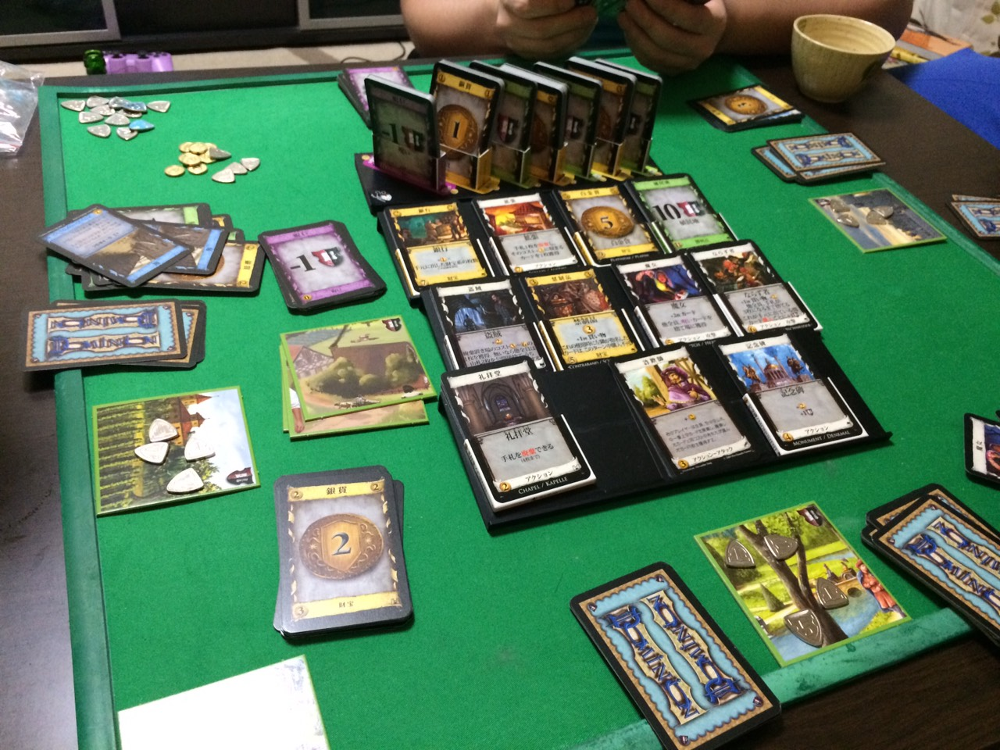

layout: true
class: center, middle, inverse
---
## Gunma.web #22
## 「オレオレ勉強法(Node.js編)」
### @ace
---
layout: false
# self-introduction  
***
.left-column[
    
]
.right-column[
- ###角田祐一
- ###ace @ace_project
- ###フリーランスエンジニア
- ###浦和在住グンマー県民
- ###Hachioji.pm Node学園
]
---
# Work
***
- ###Webサービスの運営、開発
- ###普段は100%Perl
- ###趣味でNodeはじめてみた
- ###引きこもり（完全在宅）
---
# Hobby
***
- ###ギター(HR/HM)
- ###ボードゲーム（ドミニオン、麻雀）


(このへんに興味ある人は是非Twitterフォローください)
@ace_project
---
layout: true
class: center, middle, inverse
---
# 本題
## 「オレオレ勉強法(Node.js編)」
---
layout: false
#きっかけ
- ###YAPC::ASIA 2015

- ###Node.jsとio.jsが統合されてNode.js 4.0が出るよ！  
→じゃあ使ってみよう
---
# 私もLTやってきました

---
# 会場の様子(1000人超)

---
class: center, middle
##***「観客は大根だと思え！」
---
class: center, middle
##「大根も１０００本あったら  
##ビビる！！！」
---
class: center, middle
## これ割とウケるんで各地の勉強会で使ってます
---
# Node.jsとは
- ###サーバーサイドJavascript
- ###開発が超活発
- ###ノンブロッキングI/O
---
# 開発が超活発
- ###Node v4.0.0
    2015/9/8
- ###Node v5.0.0
    2015/10/29
  ####悪く言うと過渡期（セオリーがない）
---
# 対して・・・
- ###Perl 5.6.0 
    2000/5/2
- ###Perl 6.0.0 
    2015/12/25
---
# ノンブロッキングI/Oとは？
- Node.js
```node.js
var buf = fs.readFile('data.txt', function(err, buf){
        if(!err){
                console.log('success!');
        }
}
console.log('hello world');
```
---
# ノンブロッキングI/Oとは？
- Node.js
```node.js
var buf = fs.readFile('data.txt', function(err, buf){
        if(!err){
                console.log('success!');
        }
}
console.log('hello world');
```
- 結果
```node.js
hello world success!
```
---
# オレオレ勉強法その１
- ###workshopper
---
# オレオレ勉強法その２
- ###一度に全部やろうとしない
---
#MEANスタック
- ##**M**ongoDB
- ##**E**xpress
- ##**A**ngular.js
- ##**N**ode.js
(LAMPとかXAMPPみたいなバンドル)
---
#ひとまず
- ##~~**M**ongoDB~~
- ##**E**xpress
- ##~~**A**ngular.js~~
- ##**N**ode.js
---
#オレオレ勉強法その３
- ###とりあえずクソモジュール作る
---
#テスト書きたい
- ###Perlの人なのでテスト書きたい
- ###TDD(Test-Driven Development)
---
#TDDの例
index.htmlを作る場合
```javascript
describe('get', function(){
    statusCodeIs("http://test.com/index.html", 200);
})
```
---
#Node.jsのテストフレームワーク
- ###Mochaが凄いらしい
---
#Reporterがすごい
-dot
```javascript
[tsunoda@ip-172-30-1-57 bowtest]$ mocha -R dot


  ․․․․․․․․․․․․․․․

  15 passing (8ms)
```
-progress
```javascript
[tsunoda@ip-172-30-1-57 bowtest]$ mocha -R progress

  [▬▬▬▬▬▬▬▬▬▬▬▬▬▬▬▬▬▬▬▬▬▬▬▬▬▬▬▬▬▬▬▬▬▬▬▬▬▬▬▬▬▬▬▬▬▬▬▬▬▬▬▬▬▬▬▬▬▬▬▬▬▬▬▬▬▬▬▬▬▬▬▬▬▬▬▬▬▬▬▬▬▬▬▬▬▬▬▬▬▬▬▬▬▬]

  15 passing (12ms)
```
---
-json
```javascript
[tsunoda@ip-172-30-1-57 bowtest]$ mocha -R json
{
  "stats": {
    "suites": 6,
    "tests": 15,
    "passes": 15,
    "pending": 0,
    "failures": 0,
    "start": "2016-01-12T13:31:53.655Z",
    "end": "2016-01-12T13:31:53.661Z",
    "duration": 6
  },
  "tests": [
　  ...
  ]
}
```
---
- nyan
```javascript
[tsunoda@ip-172-30-1-57 bowtest]$ mocha -R nyan
 15  -_-_-_-_-_-_-_-__,------,
 0   -_-_-_-_-_-_-_-__|  /\_/\
 0   -_-_-_-_-_-_-_-_~|_( ^ .^)
_    -_-_-_-_-_-_-_-_ ""  ""

  15 passing (18ms)
```
- 元ネタ？  

---
## テストがこけると猫がダウン
```javascript
[tsunoda@ip-172-30-1-57 bowtest]$ mocha -R nyan
 14  -_-_-_-_-_-_-_-__,------,
 1   -_-_-_-_-_-_-_-__|  /\_/\
 0   -_-_-_-_-_-_-_-_~|_( x .x)
     -_-_-_-_-_-_-_-_ ""  ""

  14 passing (22ms)
  1 failing

  1) Array #indexOf() should return -1 when the value is not present:

      AssertionError: -1 == 2
      + expected - actual

      --1
      +2

      at Context.<anonymous> (test/test.js:7:14)
```
---
class: center, middle
# どうでもいい話ですが
# 犬派です
---
# mocha-bow-reporter

https://github.com/aceproject/mocha-bow-reporter
---
- bow
```javascript
[tsunoda@ip-172-30-1-57 bowtest]$ mocha -R mocha-bow-reporter
 15  -_-_-_-_-_-_-_-_-_-_- /)_/)
 0   -_-_-_-_-_-_-_-_-_-_ < ^ .^>
 0   -_-_-_-_-_-_-_-_- ﾉ) /　　|
_   -_-_-_-_-_-_-_-_- ＼(＿＿_)

  15 passing (20ms)
```
---
## 犬もダウン
```javascript
[tsunoda@ip-172-30-1-57 bowtest]$ mocha -R mocha-bow-reporter
 14  -_-_-_-_-_-_-_-_-_-_- /)_/)
 1   -_-_-_-_-_-_-_-_-_-_ < x .x>
 0   -_-_-_-_-_-_-_-_- ﾉ) /　　|
     -_-_-_-_-_-_-_-_- ＼(＿＿_)

  14 passing (24ms)
  1 failing

  1) Array #indexOf() should return -1 when the value is not present:

      AssertionError: -1 == 2
      + expected - actual

      --1
      +2

      at Context.<anonymous> (test/test.js:7:14)
```
---
# まとめ
###workshopperおすすめ

###やりたいことに合わせて勉強することを限定する
- 自分のレベルに合わせる（習作でAngular、Mongo使うようなのは作らないとか）

###Pluggableなモジュールのプラグインを作ると勉強になる
- Pluggableになってるモジュールはだいたいちゃんと書いてあるので勉強になる
- AA変えるだけでも全体を追ったので勉強になりました
---
class: center, middle
## [急募]犬のAA書ける人
（Pull-Reqしてください)
---
layout: true
class: center, middle, inverse
---
## ご静聴ありがとうございました！
