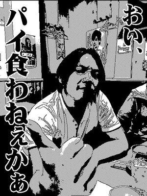
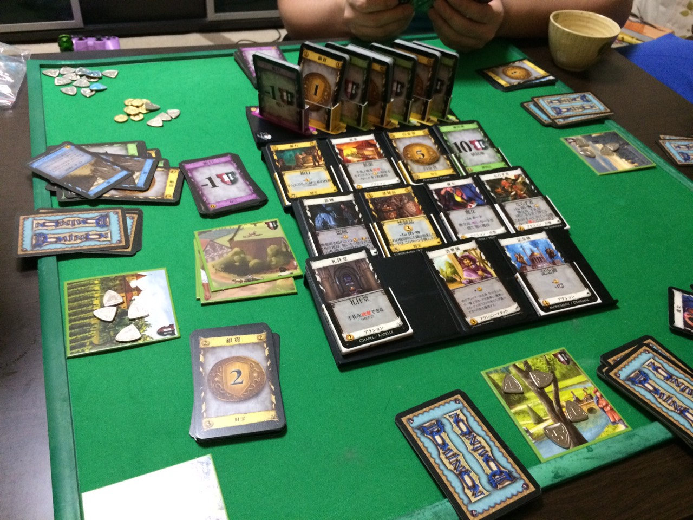
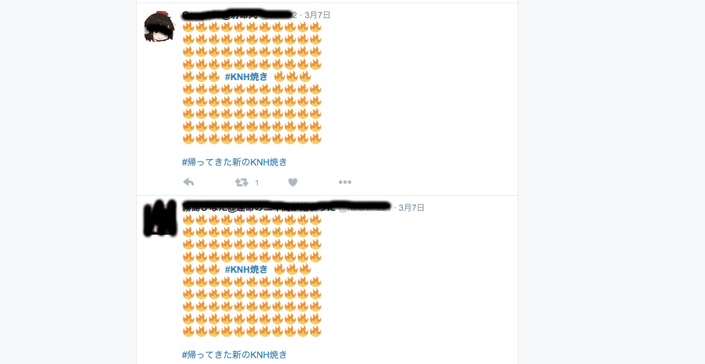
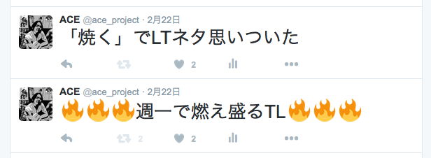

layout: true
class: center, middle, inverse
---
## Gunma.web #23
## 「JavascriptでParticle」
### @ace
---
layout: false
# self-introduction  
***
.left-column[
    
]
.right-column[
- ###角田祐一
- ###ace @ace_project
- ###フリーランスエンジニア
- ###浦和在住グンマー県民
- ###Hachioji.pm Node学園
]
---
# Work
***
- ###Webサービスの運営、開発
- ###仕事　Perl
- ###趣味　Node.js
- ###引きこもり（完全在宅）
---
# Hobby
***
- ###ギター(HR/HM)
- ###ボードゲーム（ドミニオン、麻雀）

---
# Agenda
- ##Particleとは？
- ##デモ
- ##コードの解説
- ##なんでやろうと思ったか
---
layout: true
class: center, middle, inverse
---
# Particleとは？
---
layout: false
#Particle
主な意味(微)分子、粒子、小片、極小量、みじん、不変化詞、小詞、小辞、接頭辞
音節    par・ti・cle    発音記号    
/pάɚṭɪkl(米国英語), pάːṭɪkl(英国英語)/
#パーティクルシステム
パーティクル・システム（英: particle system）はコンピュータグラフィック技術のひとつで、従来型のレンダリング技術では再現が難しい、ある種の曖昧さを持った事物をシミュレートするために使われる。
by wikipedia
---
#要するに
粒をいっぱい重ねて炎とか煙を再現するグラフィック技術
---
#デモ
- ##後学のためネイティブJavascriptのみで作ってますが以下のライブラリなどを使うとより簡単にそれっぽくできます。
###Particle.js, three.js(WebGL), ゲーム系ライブラリ
---
class: center, middle
##なんでやろうと思ったのか？
---
class: center, middle
##Gunma.webに参加してから・・・
---
class: center, middle
##週１でタイムラインが炎上する
---
class: center, middle

---
class: center, middle

---
class: center, middle
# 最後に
---
class: center, middle
# <S>「JavascriptでParticle」</S>
# 「ParticleでKNH焼き」
---
class: center, middle
## ご静聴ありがとうございました！
