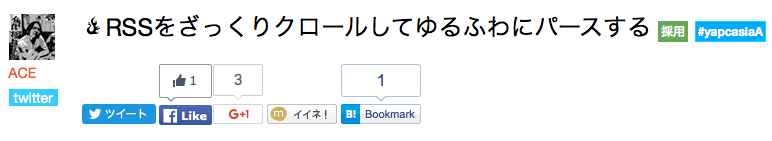
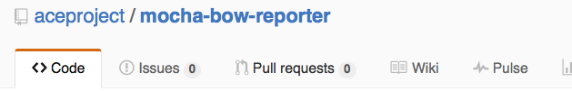

layout: true
class: center, middle, inverse
---
## 東京Node学園付属小学校 1時限目
## 「Node.jsオレオレ勉強法」
---
layout: false
# self-introduction  
***
.left-column[
    
]
.right-column[
- ###ＡＣＥ @ace_project
- ###フリーランスエンジニア
- ###浦和在住グンマー県民
（都内に引越し予定）
- ###Hachioji.pm GunmaWeb
- ###Noder歴２ヶ月ぐらい
]
---
# Work
***
- ###Webサービスの運営、開発
- ###普段は100%Perl
- ###引きこもり（完全在宅）
---
# Hobby
***
- ###ギター(HR/HM)
- ###ボードゲーム（ドミニオン、麻雀）


(このへんに興味ある人は是非Twitterフォローください)
@ace_project
---
layout: true
class: center, middle, inverse
---
# 本題
# 「Node.jsオレオレ勉強法」
---
layout: false
#きっかけ
- ###YAPC::ASIA 2015

- ###Node.jsとio.jsが統合されてNode.js 4.0が出るよ！  
→じゃあ使ってみよう
---
# 私もLTやってきました

---
# 会場の様子(1000人超)

---
class: center, middle
##***「観客は大根だと思え！」
---
class: center, middle
##「大根も１０００本あったら  
##ビビる！！！」
---
# Node.jsをはじめてみて
- とりあえずWorkshopperで勉強
- Webアプリ作ってみよう
- MEANスタック
---
#MEANスタック？
- ##**M**ongoDB
- ##**E**xpress
- ##**A**ngular.js
- ##**N**ode.js
---
#ひとまず
- ##~~**M**ongoDB~~
- ##**E**xpress
- ##~~**A**ngular.js~~
- ##**N**ode.js
---
#Webアプリを作るとなったらテスト書きたい
- Mochaというテストフレームワークが凄いらしい
---
#Reporterがすごい
-dot
```javascript
[tsunoda@ip-172-30-1-57 bowtest]$ mocha -R dot


  ․․․․․․․․․․․․․․․

  15 passing (8ms)
```
-progress
```javascript
[tsunoda@ip-172-30-1-57 bowtest]$ mocha -R progress

  [▬▬▬▬▬▬▬▬▬▬▬▬▬▬▬▬▬▬▬▬▬▬▬▬▬▬▬▬▬▬▬▬▬▬▬▬▬▬▬▬▬▬▬▬▬▬▬▬▬▬▬▬▬▬▬▬▬▬▬▬▬▬▬▬▬▬▬▬▬▬▬▬▬▬▬▬▬▬▬▬▬▬▬▬▬▬▬▬▬▬▬▬▬▬]

  15 passing (12ms)
```
---
-json
```javascript
[tsunoda@ip-172-30-1-57 bowtest]$ mocha -R json
{
  "stats": {
    "suites": 6,
    "tests": 15,
    "passes": 15,
    "pending": 0,
    "failures": 0,
    "start": "2016-01-12T13:31:53.655Z",
    "end": "2016-01-12T13:31:53.661Z",
    "duration": 6
  },
  "tests": [
　  ...
  ]
}
```
---
- nyan
```javascript
[tsunoda@ip-172-30-1-57 bowtest]$ mocha -R nyan
 15  -_-_-_-_-_-_-_-__,------,
 0   -_-_-_-_-_-_-_-__|  /\_/\
 0   -_-_-_-_-_-_-_-_~|_( ^ .^)
_    -_-_-_-_-_-_-_-_ ""  ""

  15 passing (18ms)
```
- 元ネタ？  

---
## テストがこけると猫がダウン
```javascript
[tsunoda@ip-172-30-1-57 bowtest]$ mocha -R nyan
 14  -_-_-_-_-_-_-_-__,------,
 1   -_-_-_-_-_-_-_-__|  /\_/\
 0   -_-_-_-_-_-_-_-_~|_( x .x)
     -_-_-_-_-_-_-_-_ ""  ""

  14 passing (22ms)
  1 failing

  1) Array #indexOf() should return -1 when the value is not present:

      AssertionError: -1 == 2
      + expected - actual

      --1
      +2

      at Context.<anonymous> (test/test.js:7:14)
```
---
class: center, middle
# どうでもいい話ですが
# 犬派です
---
class: center, middle
# 安心してください
---
class: center, middle
# 作りました
---
# mocha-bow-reporter

https://github.com/aceproject/mocha-bow-reporter
---
- bow
```javascript
[tsunoda@ip-172-30-1-57 bowtest]$ mocha -R mocha-bow-reporter
 15  -_-_-_-_-_-_-_-_-_-_- /)_/)
 0   -_-_-_-_-_-_-_-_-_-_ < ^ .^>
 0   -_-_-_-_-_-_-_-_- ﾉ) /　　|
_   -_-_-_-_-_-_-_-_- ＼(＿＿_)

  15 passing (20ms)
```
---
## 犬もダウン
```javascript
[tsunoda@ip-172-30-1-57 bowtest]$ mocha -R mocha-bow-reporter
 14  -_-_-_-_-_-_-_-_-_-_- /)_/)
 1   -_-_-_-_-_-_-_-_-_-_ < x .x>
 0   -_-_-_-_-_-_-_-_- ﾉ) /　　|
     -_-_-_-_-_-_-_-_- ＼(＿＿_)

  14 passing (24ms)
  1 failing

  1) Array #indexOf() should return -1 when the value is not present:

      AssertionError: -1 == 2
      + expected - actual

      --1
      +2

      at Context.<anonymous> (test/test.js:7:14)
```
---
# まとめ
###やりたいことに合わせて勉強することを限定する
- 自分のレベルに合わせる（習作でAngular、Mongo使うようなのは作らないとか）

###Pluggableなモジュールのプラグインを作ると勉強になる
- Pluggableになってるモジュールはだいたいちゃんと書いてあるので勉強になる
- AA変えるだけでも全体を追ったので勉強になりました
---
class: center, middle
## [急募]犬のAA書ける人
（Pull-Reqしてください)
---
layout: true
class: center, middle, inverse
---
## ご静聴ありがとうございました！
