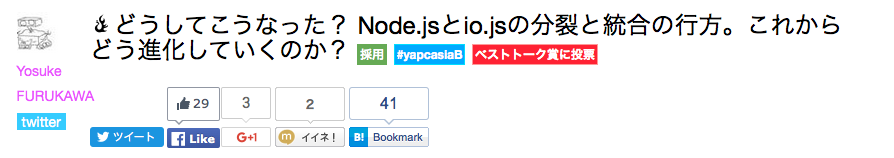

layout: true
class: center, middle, inverse
---
## 東京Node学園付属小学校 1時限目
## 「Node.jsを始めてみた」
---
layout: false
# self-introduction  
***
.left-column[
    
]
.right-column[
- ###ＡＣＥ @ace_project
- ###フリーランスエンジニア
- ###浦和在住（都内に引越し予定）
- ###Hachioji.pm GunmaWeb
- ###Noder歴２ヶ月ぐらい
]
---
# Work
***
- ###Webサービスの運営、開発
- ###普段は100%Perl
- ###完全在宅
---
# Hobby
***
- ###ギター(HR/HM)
- ###ゲーム(モンハンクロス)
- ###ボードゲーム（ドミニオン）
---
layout: true
class: center, middle, inverse
---
# 本題
---
layout: false
#きっかけ
- ###YAPC::ASIA 2015

- ###Node.jsとio.jsが統合されてNode.js 4.0が出るよ！  
→じゃあ使ってみよう
---
# 私もLTやってきました

---
class: center, middle
##***「観客は大根だと思え！」
---
class: center, middle
##「大根も１０００本あったら  
##ビビる！！！」
---
# Perlはテストを重視する
- Node.jsのテストフレームワークであるMochaに着目
---
# Mochaすごい
---
#Reporterがすごい
-dot
```javascript
[tsunoda@ip-172-30-1-57 bowtest]$ mocha -R dot


  ․․․․․․․․․․․․․․․

  15 passing (8ms)
```
-progress
```javascript
[tsunoda@ip-172-30-1-57 bowtest]$ mocha -R progress

  [▬▬▬▬▬▬▬▬▬▬▬▬▬▬▬▬▬▬▬▬▬▬▬▬▬▬▬▬▬▬▬▬▬▬▬▬▬▬▬▬▬▬▬▬▬▬▬▬▬▬▬▬▬▬▬▬▬▬▬▬▬▬▬▬▬▬▬▬▬▬▬▬▬▬▬▬▬▬▬▬▬▬▬▬▬▬▬▬▬▬▬▬▬▬]

  15 passing (12ms)
```
---
-json
```javascript
[tsunoda@ip-172-30-1-57 bowtest]$ mocha -R json
{
  "stats": {
    "suites": 6,
    "tests": 15,
    "passes": 15,
    "pending": 0,
    "failures": 0,
    "start": "2016-01-12T13:31:53.655Z",
    "end": "2016-01-12T13:31:53.661Z",
    "duration": 6
  },
  "tests": [
　  ...
  ]
}
```
---
- nyan
```javascript
[tsunoda@ip-172-30-1-57 bowtest]$ mocha -R nyan
 15  -_-_-_-_-_-_-_-__,------,
 0   -_-_-_-_-_-_-_-__|  /\_/\
 0   -_-_-_-_-_-_-_-_~|_( ^ .^)
     -_-_-_-_-_-_-_-_ ""  ""

  15 passing (18ms)
```
- 元ネタ？  

---
# 犬派もいるんじゃない？
---
class: center, middle
# 安心してください
---
class: center, middle
# 作りました
---
# mocha-bow-reporter
---
# まずはPluggableなモジュールのプラグインを作ると勉強になる
---
class: center, middle
## [急募]犬のAA書ける人
（Pull-Reqしてください)
---
layout: true
class: center, middle, inverse
---
## ご静聴ありがとうございました！
